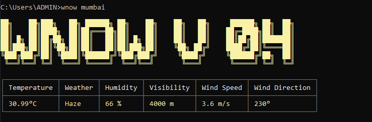

# wnow-cli
 CLI application to check the current weather in the terminal.

 

# About
  wnow is a command line program that gives you weather information for any given location using the [Open Weather Map API](https://openweathermap.org/api).


# Installation
- Clone the Repository and navigate into wnow-cli
- Run The Following Command to install dependencies
 ```sh
 npm install
 ```
- To install globally
 ```sh
 npm install -g .
 ```
- Navigate out of the wnow-cli directory

# Usage
- Set your api key
```sh
wnow set <key>
```

- Check the weather
```sh
wnow <location>
```

# Note
Please make sure to register on the Open Weather Map website and get an API key before using this application.
